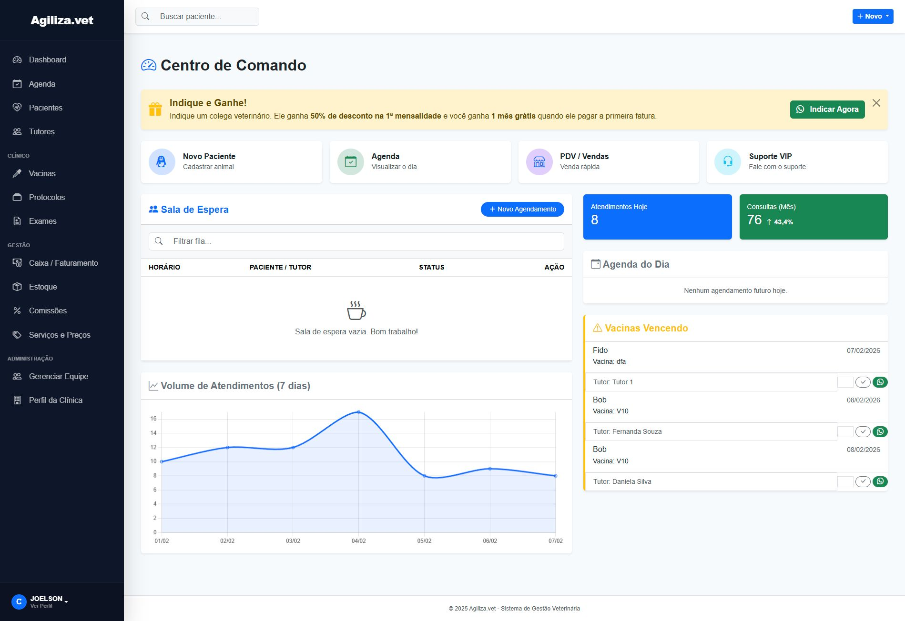
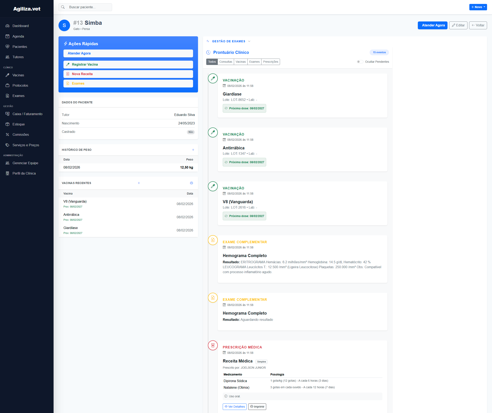

# 🐾 Agiliza.vet - SaaS for Veterinary Clinics

> **Agiliza.vet is a B2B SaaS platform designed to manage veterinary clinics, handling everything from medical records to financial scheduling.**
>
> Built with high performance, strict data isolation, and cost-efficiency in mind. Currently serving paying clients in production.

---

## 📸 Interface & Dashboard

👀 <b>Click to see more screenshots</b>

 

 

---

## 🛠 Tech Stack & Architecture

This project was built using a **Monolithic architecture** optimized for low latency, high reliability, and ease of deployment.

| Layer | Technology |
| :--- | :--- |
| **Backend** |  **Django 5** (View-based), **Celery/Gevent** (Async tasks) |
| **Database** |  **PostgreSQL 15** (Optimized for Multi-tenancy) |
| **Cache/Session** |  **Redis** (High-performance caching) |
| **Infrastructure** |  **Docker Swarm**, **Cloudflare Tunnel** (Zero Trust) |
| **DevOps** |  **Hetzner Cloud** (Prod), **Proxmox** (Staging/CI), GitHub Actions |
| **Frontend** |  **Django Templates** + **HTMX** patterns + **JavaScript** |
| **Monitoring** | **Locust** (Load Testing), Custom Dashboard |

---

## 🚀 Key Engineering Challenges Solved

### 1. Robust Multi-tenancy (Data Isolation)
Implemented a hard data isolation layer using a custom `BaseTenantModel`.
* **How it works:** Every query is automatically filtered by the active clinic (Tenant) via Middleware and Manager overrides, ensuring zero data leakage between clients.
* **Why:** Critical for **GDPR/LGPD compliance** and building trust in a B2B environment.

### 2. Financial & Commission Engine (Atomic Transactions)
Built a comprehensive financial module from scratch that handles sensitive monetary data.
* **Feature:** Automatically calculates commissions for veterinarians based on performed procedures and successful billing.
* **Reliability:** Uses `transaction.atomic()` to ensure that stock deduction and financial entries happen simultaneously or not at all (ACID compliance).
* **Integration:** Tracks Accounts Receivable and Cash Flow in real-time.

### 3. Cost-Efficient Infrastructure (DevOps)
Migrated from expensive managed services (AWS RDS) to a self-managed architecture.
* **Result:** Reduced monthly infrastructure costs by **~80%** while increasing performance.
* **Stack:** **Docker Swarm** for orchestration, **Cloudflare Tunnel** for secure ingress (no open ports exposed to the public internet), and local NVMe storage for databases.

### 4. Custom RBAC (Role-Based Access Control)
Granular permission system beyond standard Django Groups.
* **Logic:** Permissions are checked at the View level using custom decorators and mixins.
* **Profiles:** Veterinarians, Receptionists, and Admins have distinct views and action permissions, integrated seamlessly with the Multi-tenant architecture.

---

### ⚠️ Disclaimer
*This is a closed-source commercial product. This repository serves as a technical portfolio entry to demonstrate architectural decisions, coding standards, and product vision.*

🔗 [**Visit Live Website**](https://agiliza.vet)